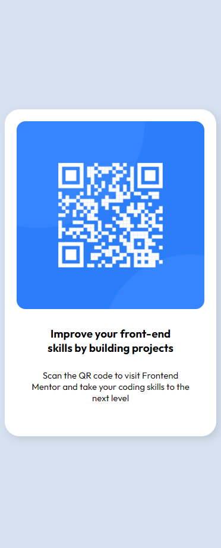

# QR Code Component (Newbie lvl)

## Table 

- [Preview](#preview)
 - [Prints](#prints)
 - [Links](#links)

## Preview

### Links

- Preview: [Link](https://nyyu.github.io/frontEndMentor-qrCodeComponent/);
- FrontEnd Mentor: [Link](https://www.frontendmentor.io/challenges/qr-code-component-iux_sIO_H);

### Prints

  

